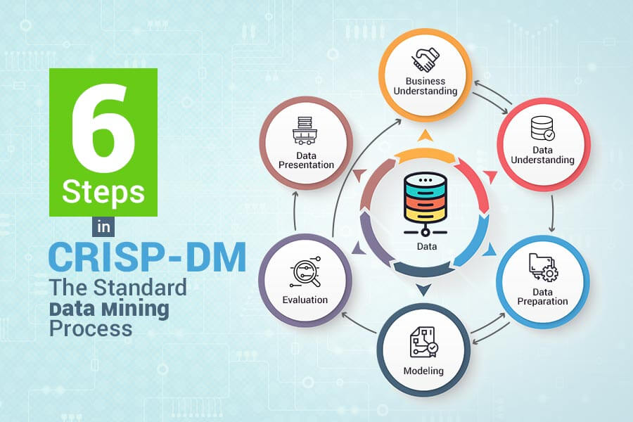

# fuel_efficiency_analysis
The repository concerns the fuel efficiency analysis of different vehicles from different manufacturers based on the data from the Depart of Energy, US.
* One post about this project has been shared on [medium](https://jyi3.medium.com/how-to-conduct-data-science-based-on-the-business-context-239cf934cee8)
* The recording of the presentation has been posted on [YouTube](youtube.com/watch?v=kHunTjkJPow&feature=youtu.be)
* The steps of the data science process: **gather, assess, clean, analyze, model, visualize**
* This project employs the **CRISP-DM** process.

## Installation

This project analyzes the dataset and builds the model to predict the mpg. 

A few libraries need to be imported:
* [Numpy](https://numpy.org/)
* [Pandas](https://pandas.pydata.org/)
* [Matplotlib](https://matplotlib.org/)
* [time](https://docs.python.org/3/library/time.html)
* [sklearn](https://scikit-learn.org/stable/)

## Project motivation

This project explores how the features of vehicles impact their fuel efficiency. The data is directly taken from the Department of Energy, US Government. Their fuel efficiency is evaluated by their mile per gallon (MPG) under different conditions. It could be potentially used in the design of vehicles and the implementation of environmental standards.

## File description
The detailed dataset and description of features can be accessed [here](https://www.fueleconomy.gov/feg/ws/index.shtml#vehicle).

## How to interact with my project
You can send pull request or suggestions to me.

## Reference
* CRISP-DM
  * [CRISP-DM Overview- Data Science Project Management](https://www.datascience-pm.com/crisp-dm-2/)
  * [Manage your next Data Science Project with CRISP-DM METHOD](https://analyticsindiamag.com/crisp-dm-data-science-project/)
  * [Six steps in CRISP-DM the standard data mining process](https://www.proglobalbusinesssolutions.com/six-steps-in-crisp-dm-the-standard-data-mining-process/)
* Jupyter Notebook
  * [Jupyter Notebook Best Practices](https://towardsdatascience.com/jupyter-notebook-best-practices-f430a6ba8c69)
  * [Jupyter Notebook Shortcuts](https://towardsdatascience.com/jypyter-notebook-shortcuts-bf0101a98330)
  * [PEP 8 -- Style Guide for Python Code](https://www.python.org/dev/peps/pep-0008/)
* Code resources
  * [Python Docstrings](https://www.geeksforgeeks.org/python-docstrings/)
  * [Docstring vs Comments](https://stackoverflow.com/questions/19074745/docstrings-vs-comments)
  * [Do not Repeat Yourself](https://www.youtube.com/watch?v=IGH4-ZhfVDk)
* How to work with missing data
  * [Working with Missing Data](https://pandas.pydata.org/pandas-docs/version/0.22/missing_data.html)
* Data Science project structure
  * [Manage your data science project structure in early stage](https://towardsdatascience.com/manage-your-data-science-project-structure-in-early-stage-95f91d4d0600)
  * [How to write a good README for your GitHub project?](https://bulldogjob.com/news/449-how-to-write-a-good-readme-for-your-github-project)
* How to write post blog
  * [The Art of Storytelling in Analytics and Data Science | How to Create Data Stories?](https://www.analyticsvidhya.com/blog/2020/05/art-storytelling-analytics-data-science/)
  * [5 reasons why programmers should blog](https://medium.com/datadriveninvestor/5-reasons-why-programmers-should-blog-93687009272b)
  * [Medium Titles, Subtitles, and Kickers](https://medium.com/blogging-guide/medium-titles-subtitles-and-kickers-ce28a5700487)
  * [How you write headlines](https://medium.com/the-mission/this-new-data-will-make-you-rethink-how-you-write-headlines-751358f6639a)

## Licensing, author, acknowledgement
MIT license. I want to thank anyone who help me on the journey of data science.
